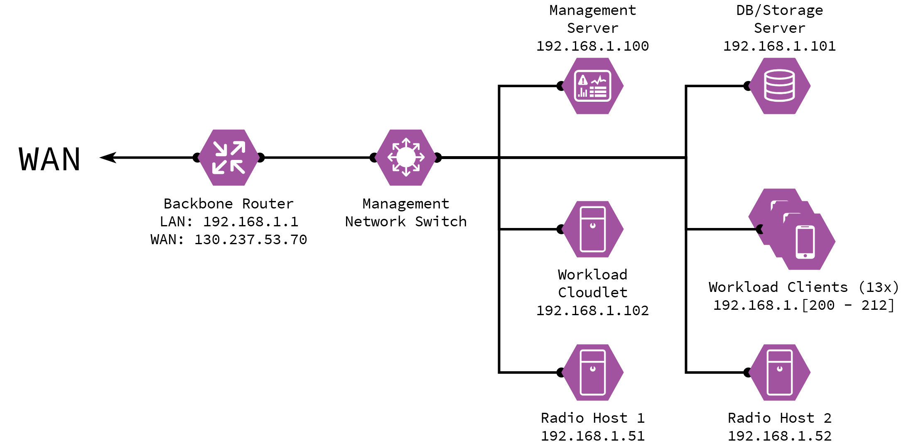

# Management Network and Hardware Setup

This page details the current setup for the management network, used for the *alpha* version of the testbed.

## Physical Setup

1. **Cisco Router:** principarily handles WAN connectivity, NAT, and DHCP assignments.
    DHCP might be moved out of here eventually.
2. **Intel NUC:** acts as the *Management Server*.
    It is also the entrypoint to the testbed network when accessing it remotely.
3. **Dell Optiplex 7060**: acts as the *Workload Cloudlet*.
4. **Dell Optiplex 9020**: acts as the *DB/Storage Server*.
5. **Custom Build 1**: assigned to *Radio Host 1*.
6. **Custom Build 2**: assigned to *Radio Host 2*.
7. **NETGEAR JGS524v2 Switch**: management network switch.
8. **13x Raspberry Pi 4B**: workload clients.

## Network Setup

***Work in progress.***
