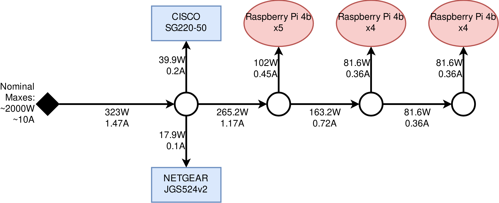

# Notes for the future

## Power considerations

As of August 2021, the testbed is setup with a stable but not-very-scalable power supply configuration.
While we are still within the nominal power and current comsumption on all of the power supplies we are using, we should consider incorporating proper power supplies and UPS to the setup.

Below you can see the current power and current consumption of the Raspberry Pi cluster plus the workload and management switches.

## Server rack

As the testbed matures, we will have to migrate the physical setup to something more manageable.
We will not only need to incorporate proper power supply solutions (as mentioned above), but also solutions for proper cooling of the equipment as well as cable management.
In this context it makes sense to go for a full server rack setup, where we mount the whole testbed in a rack.

Some options for racks in Sweden:

- [StarTech.com](https://www.startech.com/sv-se/serverhantering/hyllor)
- [Dustin.se](https://www.dustin.se/group/hardvara/server-storage/rackkabinetter-tillbehor/rackkabinett)

### Blade mounts for the Raspberry Pis

The biggest challenge in getting a rack setup up and running will be acquiring appropriate hardware to mount the Raspberry Pis into a standard server rack.
Here is a collection of some options found online:

- [Raspberry Pi 4 Rack Mount 19 Inch 1U Bracket w/ OLED Monitor, Power Switch & Cooling Fan](https://www.uctronics.com//raspberry-pi-4-rack-mount-19-inch-1u-bracket.html)
- [[DRP2] Industrial DIN Rail Mount](https://dinrplate.com/%5Bdrp2%5D)
- [BitScope Cluster Blade](http://my.bitscope.com/store/?p=view&i=item+3)

#### Other solutions

In case we decide against going for a server rack setup, there exist some other alternatives online for a clean and easy to manage Raspberry Pi clustering setup:

- For holding the Raspberry Pis: [GeeekPi Raspberry Pi cluster case (multiple derivatives)](https://www.amazon.se/GeeekPi-Raspberry-Clusterfodral-hallon-stapelbart/dp/B08FHJ5TR2/ref=sr_1_30?dchild=1&keywords=GeeekPi&qid=1626084796&sr=8-30)
- For power supply:
    - [Anker PowerPort 10](https://www.amazon.se/Anker-PowerPort-10-port-USB-laddare-iPhone/dp/B00YTJ45HM/ref=pd_sim_2/262-4676572-0361040?pd_rd_w=CKKR3&pf_rd_p=6469eaa9-63e0-4609-99c0-ff67d019cf87&pf_rd_r=8RD6MR6K646R5CGDV7DT&pd_rd_r=a7eae9fe-114b-4dac-946f-5a3306282a42&pd_rd_wg=YNnAD&pd_rd_i=B00YTJ45HM&th=1)
    - [GeeekPi Gigabit USB-C PoE-splitter](https://www.amazon.se/GeeekPi-PoE-splitter-IEEE802-3af-Raspberry-surfplattor/dp/B0832QR4NG/ref=sr_1_11?dchild=1&keywords=GeeekPi&qid=1626107591&sr=8-11)