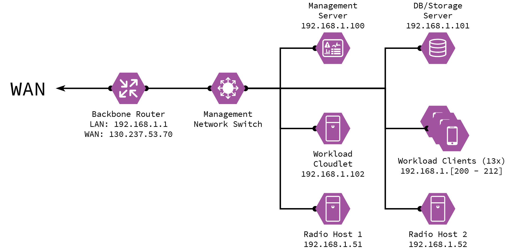

# Management Network and Hardware Overview

This page details the current setup for the management network, used for the *alpha* version of the testbed.

## Physical Setup

|  	| Device 	| Role 	| FQDN 	| IP 	| Services 	|
|-	|-	|-	|-	|-	|-	|
| **1** 	| Cisco RV160 Router 	| Ingress Router 	| cirdan.expeca.org 	| 192.168.1.1 	| NAT, DHCP 	|
| **2** 	| Intel NUC8i7HNK 	| Management 	| galadriel.expeca.org 	| 192.168.1.100 	| Ansible, NTP, DNS 	|
| **3** 	| DELL Optiplex 7060 	| Cloudlet 	| elrond.expeca.org 	| 192.168.1.102 	| - 	|
| **4** 	| DELL Optiplex 9020 	| DB/Storage 	| celeborn.expeca.org 	| 192.168.1.101 	| Fluentd, Database (WIP) 	|
| **5** 	| Custom Build 1 	| Radio Host 1 	| fingolfin.expeca.org 	| 192.168.1.51 	| - 	|
| **6** 	| Custom Build 2 	| Radio Host 2 	| finarfin.expeca.org 	| 192.168.1.52 	| - 	|
| **7** 	| NETGEAR JGS524v2 Switch 	| Management Network Switch 	| - 	| - 	| - 	|
| **8** 	| 13x Raspberry Pi 4B 	| Workload Clients 	| workload-client-[01:13].expeca.org 	| 192.168.1.2[00:12] 	| - 	|

## Network Setup

<!--  -->

## Auth and remote access configuration

SSH access to the network is exposed through port `2222/tcp` of the ingress router at `130.237.53.70`; this port is redirected internally to the SSH daemon listening on port `22/tcp` of the management server `galadriel.expeca.org`.
Once inside the network, you can [pivot](#pivoting-into-hosts-from-management-server-using-agent-forwarding) into any of the other hosts, all of which have SSH daemons listening on port `22/tcp`.

For security, remote access is **only** allowed through *[public key authentication](https://wiki.archlinux.org/title/SSH_keys)*.
All devices have a single default user `expeca`, which has no password, and `sudo` is configured for full passwordless access for this user.
The management server `galadriel.expeca.org` additionally has a user for each member of the group; usernames are the same as the respective group member's KTH ID.
These users also have full passwordless `sudo` privileges.

### Pivoting into hosts using agent forwarding

For security reasons, do not copy your private key to the management host. Instead, use [SSH Agent Forwarding](https://docs.github.com/en/developers/overview/using-ssh-agent-forwarding).

1. If not done already, initialize the SSH Agent and add your key:
    - For Mac OS X, [see here.](https://rob.cr/blog/using-ssh-agent-mac-os-x/)
    - For Linux, [see here.](https://www.cyberciti.biz/faq/how-to-set-up-ssh-keys-on-linux-unix/)
	
2. When connecting to the management host, forward your SSH Agent:
    - On the command line, use the `-A` flag: `#!bash ssh expeca@130.237.53.70 -p 2222 -A`.
    - Add an entry to your `.ssh/config` file:

            Host ExpecaManagement 130.237.53.70
                Hostname 130.237.53.70
                Port 2222
                IdentityFile ~/.ssh/your_ssh_private_key
                User expeca
                ForwardAgent yes
