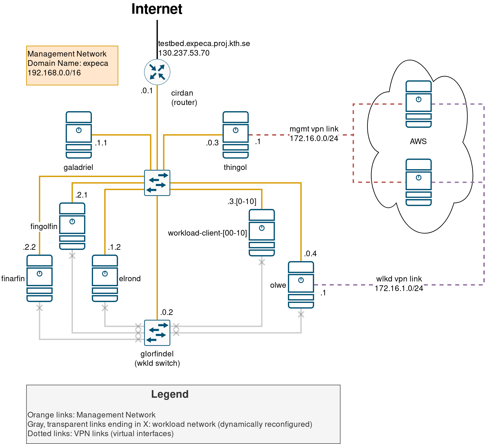

# Management Network and Hardware Overview

This page details the current setup for the management network, used for the *alpha* version of the testbed.

## Physical Setup

|  	| Device 	| Role 	| FQDN 	| IP 	| Network Services 	|
|-	|-	|-	|-	|-	|-	|
| **1** 	| Cisco RV160 Router 	| Ingress Router 	| cirdan.expeca 	| 192.168.1.1 	| NAT, 	|
| **2** 	| Intel NUC8i7HNK 	| Management 	| galadriel.expeca 	| 192.168.1.2 	| DHCP, DNS, NTP |
| **3** 	| DELL Optiplex 7060 	| Cloudlet 	| elrond.expeca 	| 192.168.1.4 	| - |
| **4** 	| DELL Optiplex 9020 	| DB/Storage 	| celeborn.expeca 	| 192.168.1.3  | - |
| **5** 	| Custom Build 1 	| Radio Host 1 	| fingolfin.expeca 	| 192.168.1.51 	| - 	|
| **6** 	| Custom Build 2 	| Radio Host 2 	| finarfin.expeca 	| 192.168.1.52 	| - 	|
| **7** 	| NETGEAR JGS524v2 Switch 	| Management Network Switch 	| - 	| - 	| - 	|
| **8** 	| 13x Raspberry Pi 4B 	| Workload Clients 	| workload-client-[00:12].expeca 	| 192.168.1.1[00:12] 	| - 	|
| **9** 	| Cisco SG220-50 Switch	| Workload Network Switch 	| glorfindel.expeca 	| 192.168.1.5 	| - 	|

## Network Configuration

The management network is configured as follows:

- The ingress router `cirdan` is configured as a NAT gateway.
    It manages two VLANs (see image below for more details):

    - VLAN1 is only assigned to ethernet port 1 (untagged), and is excluded from all other ports.
        This VLAN corresponds to the actual management network.
        Note that the router only acts as a switch and NAT for this VLAN, as DHCP and DNS are handled by `galadriel`.
    - VLAN2 is assigned to all other ports (untagged), and is excluded from port 1.
        This VLAN is intended for external devices we might connect to manage the cluster (laptops, for instance).
        DHCP for this VLAN is handled by `cirdan` (DNS is redirected to `galadriel` however).

    

- As mentioned above, on the management network, both DHCP *and* DNS are handled by `galadriel`.

    - We use [Pi-Hole](https://pi-hole.net/) + [Unbound DNS](https://www.nlnetlabs.nl/projects/unbound/about/) as our integrated DHCP+DNS solution (with the added benefit of ad-blocking thanks to Pi-Hole).
        These are deployed together as two containerized services with `docker-compose`, see [here](https://docs.pi-hole.net/guides/dns/unbound/) and [here](https://hub.docker.com/r/klutchell/unbound), as well as our [Ansible role for this](https://github.com/KTH-EXPECA/TestbedConfig/blob/master/ansible/roles/pihole_dhcp_dns/tasks/main.yml).
    - See (TODO: add link) for details on how to modify the DHCP and/or DNS bindings.

- Finally, `galadriel` is also configured as an NTP server for the network, using a containerized [`chrony` instance](https://hub.docker.com/r/cturra/ntp/).
    Devices sync to this server using `systemd-timesyncd`.
    See our [Ansible role](https://github.com/KTH-EXPECA/TestbedConfig/blob/master/ansible/roles/ntp/tasks/main.yml) for more details.
<!--  -->

<!-- ## Auth and remote access configuration

SSH access to the network is exposed through port `2222/tcp` of the ingress router at `130.237.53.70`; this port is redirected internally to the SSH daemon listening on port `22/tcp` of the management server `galadriel.expeca`.
Once inside the network, you can [pivot](#pivoting-into-hosts-from-management-server-using-agent-forwarding) into any of the other hosts, all of which have SSH daemons listening on port `22/tcp`.

For security, remote access is **only** allowed through *[public key authentication](https://wiki.archlinux.org/title/SSH_keys)*.
All devices have a single default user `expeca`, which has no password, and `sudo` is configured for full passwordless access for this user.
The management server `galadriel.expeca` additionally has a user for each member of the group; usernames are the same as the respective group member's KTH ID.
These users also have full passwordless `sudo` privileges.

### Pivoting into hosts using agent forwarding

For security reasons, do not copy your private key to the management host. Instead, use [SSH Agent Forwarding](https://docs.github.com/en/developers/overview/using-ssh-agent-forwarding).

1. If not done already, initialize the SSH Agent and add your key:
    - For Mac OS X, [see here.](https://rob.cr/blog/using-ssh-agent-mac-os-x/)
    - For Linux, [see here.](https://www.cyberciti.biz/faq/how-to-set-up-ssh-keys-on-linux-unix/)
	
2. When connecting to the management host, forward your SSH Agent:
    - On the command line, use the `-A` flag: `#!bash ssh expeca@130.237.53.70 -p 2222 -A`.
    - Add an entry to your `.ssh/config` file:

            Host ExpecaManagement 130.237.53.70
                Hostname 130.237.53.70
                Port 2222
                IdentityFile ~/.ssh/your_ssh_private_key
                User expeca
                ForwardAgent yes -->
