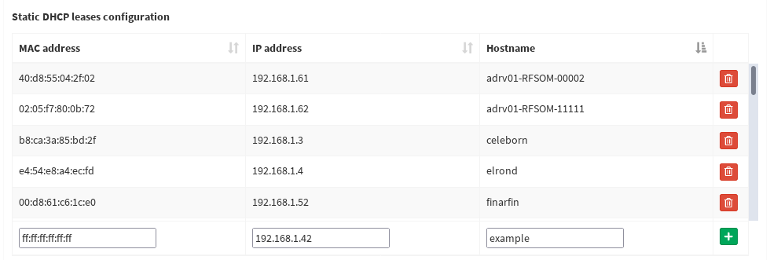
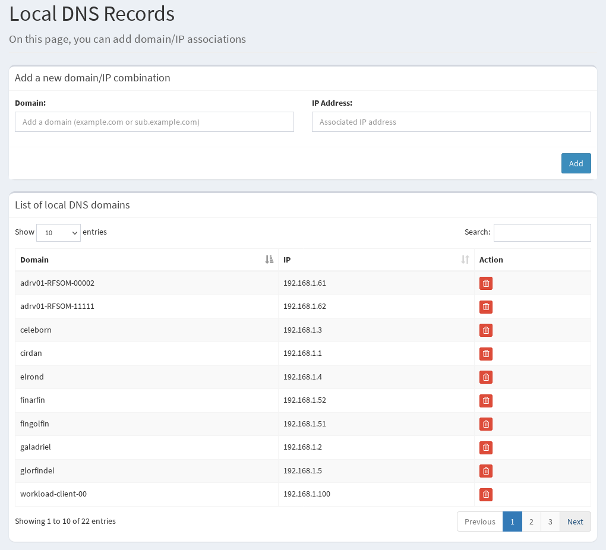

# Modifying DHCP bindings and DNS records

DHCP bindings and *local* DNS records for the management network are handled both by a [Pi-Hole](https://pi-hole.net/) instance running on `galadriel`.
Pi-Hole has a very comprehensive and powerful web-interface through which basically all of its core functionality can be configured.
To access this interface, simply point your browser to [http://galadriel.expeca/admin/](http://galadriel.expeca/admin/) from any device connected to the management network.
To log-in you will need a password you can find in the associated [Ansible variables file on the `KTH-EXPECA/TestbedConfig` repo](https://github.com/KTH-EXPECA/TestbedConfig/blob/master/ansible/roles/pihole_dhcp_dns/vars/main.yml).

## A note on modifying the settings on the Pi-Hole web interface

Any changes to the settings on the Pi-Hole web interface will persist through reboots of `galadriel` or restarts of the associated Docker containers.
They will however be discarded if the [Ansible role](https://github.com/KTH-EXPECA/TestbedConfig/blob/master/ansible/roles/pihole_dhcp_dns/tasks/main.yml) used to provision the Pi-Hole instance is re-run.
To configure settings in a way that will persist even through re-runs of the Ansible playbook, see the sections below relating to adding settings to the base Ansible configuration.

## Adding DHCP bindings

### Modifying DHCP bindings on the running Pi-Hole instance

- Open the Pi-Hole administration panel at [http://galadriel.expeca/admin/](http://galadriel.expeca/admin/) and log-in.
- Head to `Settings -> DHCP`.
- Scroll down to `Static DHCP leases configuration`.
- To add a binding, write in the target MAC address, assigned IP address, and hostname at the bottom of the list, then click on the green plus icon.
- To remove a binding, simply click on the red trashcan icon next to it.
- Disconnect and reconnect the affected device.

### Modifying DHCP bindings on the base Ansible configuration

DHCP bindings on the base Ansible configuration are built from the [Ansible inventory itself](https://github.com/KTH-EXPECA/TestbedConfig/tree/master/ansible/inventory).

To change/add a binding for a host managed by Ansible (e.g. `galadriel` or `elrond`), simply change the associated `ansible_host` and/or `mac` variables for said host (TODO: add link for more details on inventory).

To change/add a binding for a host *not* managed by Ansible (such as the workload switch `glorfindel`), modify the variable `mgmt_net.additional_hosts` in the [`groupvars/all.yml` file.](https://github.com/KTH-EXPECA/TestbedConfig/blob/master/ansible/inventory/group_vars/all.yml) (TODO: add link for more details on inventory)

## Adding DNS records

### Modifying DNS bindings on the running Pi-Hole instance

- Open the Pi-Hole administration panel at [http://galadriel.expeca/admin/](http://galadriel.expeca/admin/) and log-in.
- Head to `Settings -> Local DNS -> DNS Records`.
- To add a binding, write in the desired domain/hostname and the target IP address in the input fields at the top, then click `Add`.
- To remove a binding from the `List of local DNS domains`, simply click on the red trashcan icon next to it.

### Modifying DNS records on the base Ansible configuration

As for DHCP bindings, DNS records on the base Ansible configuration are built from the [Ansible inventory itself](https://github.com/KTH-EXPECA/TestbedConfig/tree/master/ansible/inventory).

To change/add a record for a host managed by Ansible (e.g. `galadriel` or `elrond`):

- To set the target IP address: change the associated `ansible_host` variable for the specified host.
- To set the target hostname: rename the host by changing its name on the main inventory file, `inventory/hosts.yml`, as well as renaming all host variable files associated with it. (TODO: add link for more details on inventory).

To change/add a record for a host *not* managed by Ansible (such as the workload switch `glorfindel`), modify the variable `mgmt_net.additional_hosts` in the [`groupvars/all.yml` file.](https://github.com/KTH-EXPECA/TestbedConfig/blob/master/ansible/inventory/group_vars/all.yml) (TODO: add link for more details on inventory)
