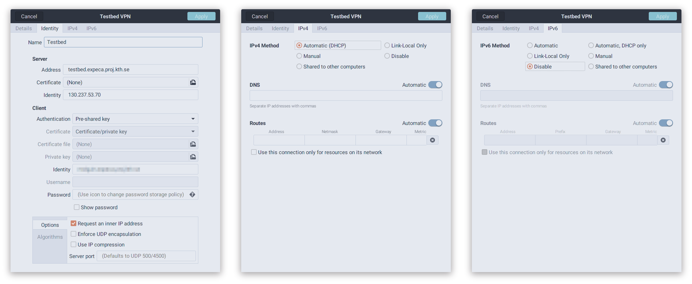
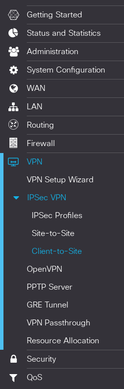
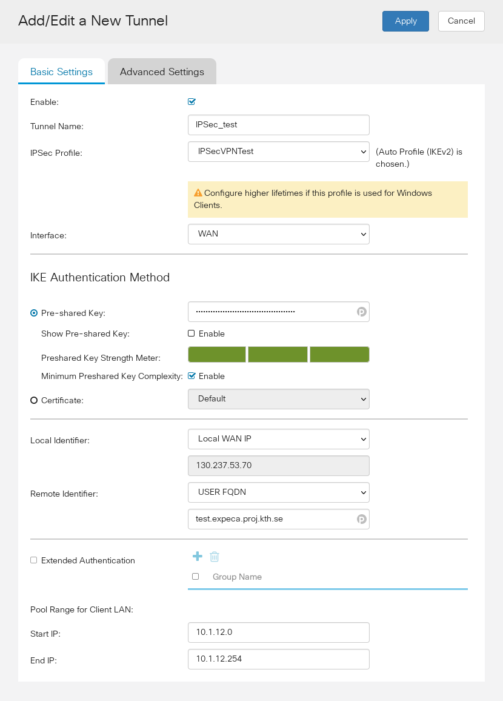
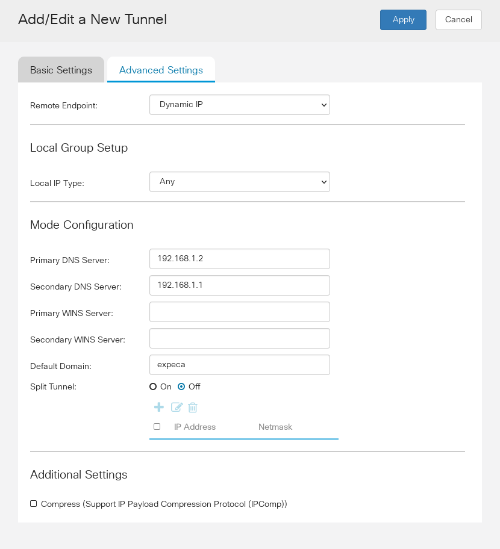

# Using a VPN connection to access the testbed remotely

## Connecting to the VPN

**Note**: To connect to the testbed IPSec VPN you must first configure an IPSec tunnel on the ingress router; [see below for details.](#configuring-a-dedicated-ipsec-tunnel)
Also note that each VPN client needs a dedicated tunnel.

Once a tunnel has been created for your client, follow the below steps to connect to the testbed.

## Install an IPSec/IKE v2 compatible VPN client

- For Linux, you may use [strongSwan](https://www.strongswan.org/) with [`NetworkManager`](https://wiki.archlinux.org/title/NetworkManager) and the [`networkmanager-strongswan`](https://wiki.strongswan.org/projects/strongswan/wiki/NetworkManager) plugin.
- For Windows, [Cisco recommends](https://www.cisco.com/c/en/us/support/docs/smb/routers/cisco-rv-series-small-business-routers/Configuring_Shrew_Soft_VPN_Client_with_the_RV160_and_RV260.html) the [Shrew Soft VPN Client](https://www.shrew.net/download/vpn).
- For Mac OSX, IKEv2 is natively supported and no external clients are needed.

## Configure your VPN Client

### Remote server configuration

- **Address**: `testbed.expeca.proj.kth.se`
- **Certificate**: None/NA
- **Identity/ID**: `130.237.53.70`

### Local client/user configuration

- **Authentication**: Pre-shared Key (Called "None" on Mac OSX and iOS).
- **Identity/ID**: The client identity chosen when creating the IPSec tunnel.
- **Password/Pre-Shared Key**: The PSK chosen when creating the IPSec tunnel.

### Network configuration

*Only change these settings if needed, i.e. if the connection does not work with the above settings.*
*In particular, these settings should not be required for connections from MacOSX, and they ARE required for `strongSwan` on Linux.*

- **Request an inner IP address**: Yes.
- **IPv4 Address**: Automatic (DHCP).
- **IPv4 DNS**: Automatic. If Automatic does not work, manually specify `192.168.1.2` (`galadriel`) and `192.168.1.1` (`cirdan`) as DNS servers.
- **IPv6 Address**: Disable.

### Example config on Linux

## Configuring a dedicated IPSec tunnel

When using IPSec, each client/user needs to have a dedicated tunnel.
Note that trying to share a tunnel between multiple clients will not work, and might lead to other problems.

To configure a dedicated IPSec tunnel for a client/user on the ingress router:

1. From inside the testbed management network (i.e. either through a physical connection, a SOCKS v5 proxy, or another VPN tunnel), access the web interface of the ingress router (`cirdan`) at `192.168.1.1` and login (credentials can be found on the `TestbedConfig` repository).
2. On the sidebar, head to `VPN -> IPSec VPN -> Client-to-Site`.

    

3. Click on the `+` (plus) symbol to add a new tunnel configuration.
4. Configure the tunnel Basic Settings:

     - Enable: Yes
     - Tunnel Name: Choose an appropriate name
       A good naming scheme is something akin to `IPSec_<user name>`
     - IPSec Profile: IPSecVPNTest
     - Interface: WAN
     - Pre-shared Key: Choose an appropriate PSK for the tunnel
       Note that it **must** be over 20 characters long (some clients -- e.g. `strongSwan` -- refuse to work with PSKs shorter than that)
     - Local Identifier: Local WAN IP; `130.237.53.70`
     - Remote Identifier: USER FQDN; `<username>.expeca.proj.kth.se`
     - Pool range for Client LAN Start: `10.1.<N>.0`
     - Pool range for Client LAN End: `10.1.<N>.254`

      Where `<N>` corresponds to a subnet not yet assigned to an IPSec tunnel.
      You can look at the other configurations on the `VPN -> IPSec VPN -> Client-to-Site` page to figure out what the lowest `<N>` available is.

      

5. Configure the tunnel Advanced Settings:

     - Remote Endpoint: Dynamic IP
     - Local IP Type: Any
     - Primary DNS Server: `192.168.1.2`
     - Secondary DNS Server: `192.168.1.1`
     - Default Domain: `expeca`
     - Split Tunnel: Off

      

6. Apply the settings.
7. Test the settings by [connecting with a VPN client.](#connecting-to-the-vpn)
8. After verifying that everything works, save the router configuration.

      1. Head to `Administration -> Configuration Management`.
      2. Click `Apply` and confirm saving the running configuration to the startup configuration of the router.